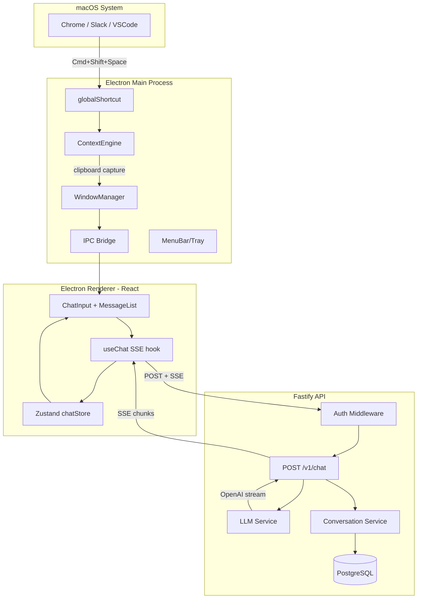

# Cursi — Project Initialization Plan

## What we're building

**Cursi** — a macOS system-wide AI assistant. Press `Cmd+Shift+Space` from any app, a frameless floating panel appears, selected text becomes AI context, streaming LLM response comes back. Backend owns the LLM key and auth; Electron owns the experience.

## Stack (from blueprint)

- **Monorepo**: pnpm workspaces + Turborepo
- **Desktop**: Electron 32+ · React 18 · TypeScript · Vite · Tailwind CSS · Zustand
- **Backend**: Node.js · Fastify · Zod · Drizzle ORM · PostgreSQL (Supabase)
- **Auth**: Supabase Auth (JWT validated on backend)
- **AI**: OpenAI SDK (streaming SSE)
- **Packaging**: electron-builder

## Target directory layout

```
cursi/                          ← workspace root (already exists)
├── apps/
│   ├── desktop/                ← Electron app
│   │   └── src/
│   │       ├── main/           ← Main process (shortcuts, windows, tray, IPC)
│   │       ├── preload/        ← Narrow contextBridge API
│   │       └── renderer/       ← React UI (chat, settings)
│   └── api/                    ← Fastify backend
│       └── src/
│           ├── routes/         ← auth, chat, conversations, users
│           ├── services/       ← chat.service, llm.service, conversation.service
│           ├── middleware/     ← auth, rate-limit
│           └── db/             ← Drizzle client, schema, migrations
├── packages/
│   ├── shared/                 ← Zod schemas, TypeScript types, constants
│   └── config/                 ← Shared tsconfig, eslint, tailwind base
├── package.json                ← pnpm workspace root
├── pnpm-workspace.yaml
└── turbo.json
```

## Key files to create (in order)

### 1. Root monorepo scaffold
- [`package.json`](package.json) — workspace root with `pnpm` and Turborepo scripts
- [`pnpm-workspace.yaml`](pnpm-workspace.yaml) — declares `apps/*` and `packages/*`
- [`turbo.json`](turbo.json) — pipeline: `build → dev`, `typecheck`, `lint`
- [`.gitignore`](.gitignore), [`.env.example`](.env.example)

### 2. `packages/shared`
- `types/index.ts` — `AIContext`, `Message`, `Conversation`, `User`
- `schemas/index.ts` — Zod schemas for API payloads
- `constants/index.ts` — shortcut defaults, API base URL

### 3. `apps/api` — Fastify backend
- `src/server.ts` — Fastify instance, plugin registration, graceful shutdown
- `src/db/schema.ts` — Drizzle schema: `users`, `conversations`, `messages`
- `src/db/client.ts` — Drizzle + postgres connection
- `src/middleware/auth.ts` — Supabase JWT validation via `fastify-plugin`
- `src/middleware/rate-limit.ts` — `@fastify/rate-limit`
- `src/services/llm/openai.ts` — implements `LLMProvider` interface (streaming)
- `src/services/llm/llm.service.ts` — factory/selector
- `src/services/chat.service.ts` — orchestrates context + LLM call
- `src/services/conversation.service.ts` — CRUD
- `src/routes/auth.ts` — `GET /v1/auth/me`
- `src/routes/chat.ts` — `POST /v1/chat` (SSE streaming)
- `src/routes/conversations.ts` — CRUD endpoints
- `.env.example` — `DATABASE_URL`, `SUPABASE_JWT_SECRET`, `OPENAI_API_KEY`, `PORT`

### 4. `apps/desktop` — Electron app
- `electron.vite.config.ts` — electron-vite config (main + preload + renderer)
- `src/main/index.ts` — app bootstrap, `app.whenReady`
- `src/main/windows.ts` — `createAIPanel()`: frameless, always-on-top, alwaysOnTop, vibrancy
- `src/main/shortcuts.ts` — `registerShortcut(combo)` via `globalShortcut`
- `src/main/tray.ts` — menu bar icon + context menu (Show, Settings, Quit)
- `src/main/ipc.ts` — IPC handlers wired to shortcut + window events
- `src/main/app-lifecycle.ts` — `activate`, `before-quit`, login-item scaffolding
- `src/preload/index.ts` — `contextBridge.exposeInMainWorld('desktop', {...})`
- `src/renderer/App.tsx` — router between Chat and Settings views
- `src/renderer/main.tsx` — React root
- `src/renderer/components/ChatInput.tsx`
- `src/renderer/components/MessageList.tsx`
- `src/renderer/components/ContextBadge.tsx`
- `src/renderer/hooks/useChat.ts` — SSE streaming hook
- `src/renderer/stores/chatStore.ts` — Zustand store
- `tailwind.config.ts`, `src/renderer/index.css`

### 5. Database migrations
- `apps/api/src/db/migrations/0001_init.sql` — creates `users`, `conversations`, `messages` tables

## Critical architectural decisions baked in

- `contextIsolation: true`, `nodeIntegration: false` on all BrowserWindows
- `LLMProvider` interface from day one so adding Anthropic/Gemini later is a swap
- `AIContext` interface from day one (selectedText, activeApplication, screenshot)
- OpenAI API key **never** leaves the backend
- Clipboard-first selected-text capture (restore previous clipboard after read)
- SSE streaming from backend through Electron IPC to React — no polling

## Data flow diagram



## Build order (matches blueprint §"Recommended build order")

1. Install pnpm globally, scaffold monorepo root
2. Create `packages/shared` with types + Zod schemas
3. Scaffold `apps/api` — working Fastify server on port 3001
4. Add Drizzle schema + migration, connect to Supabase/local PG
5. Implement `LLMProvider` + OpenAI streaming route
6. Scaffold `apps/desktop` with electron-vite
7. Create floating `BrowserWindow` panel
8. Register `Cmd+Shift+Space` global shortcut → show/focus panel
9. Wire `Esc` to hide panel via IPC
10. Build minimal Chat UI + `useChat` streaming hook
11. Implement clipboard-based selected-text context capture
12. Add menu bar / tray icon
13. Add Supabase Auth on both sides (backend JWT middleware + renderer login)
14. Wire conversation persistence
15. Add shortcut customization UI
16. Package with electron-builder → unsigned `.app` / `.dmg`

## What's NOT built in this init

Per blueprint: no RAG, no voice, no screen capture (V2), no Windows build yet, no multi-agent, no Kubernetes.
